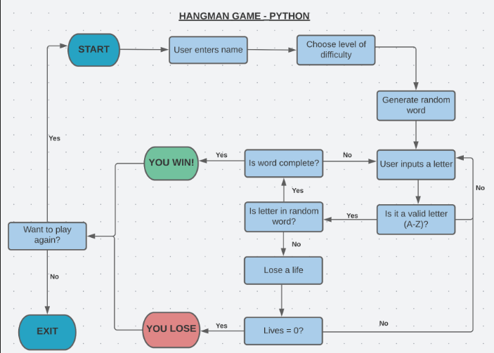

# Hungman game 
Welcome to hungman game , this is a python terminal game which is deployed to the Heroku. The main aim of this game is for the user to have fun while guessing a random word within  the given limited life. The difficulty of this game is selected by the user.

The user can play the game at three different levels of difficulty, based on the number of lives they have: 5 lives for EASY, 7 for MEDIUM, and 10 for HARD. The player wins the game if they guess the word correctly in the allotted number of guesses; Otherwise the game is over.

When the game is over the user will be asked if they wanted to start over or just leave the game.  While pressing 'Y' will restart the game with a new random word and the difficulty level chosen by the player.If any other key is pressed apart from Y ('N' or another character) will conclude the game with a 'Thanks for playing...' message followed by the Hangman logo.

live webesite for game [here](https://hungman-1.herokuapp.com/).


## FlowChart
The game work flow was created from using [Lucid](http:lucid.app). Here you can see how the game works from the starting to end ß




## Playing The Game 
The user is asked at the start and the user has to select H,M or E so the game can identify the level and random word will be shown. then the user has to guess 1 letter at a time. If the letter is not in the word, a life will be lost and a part of the gallows or a body part of the figure will appear or else If the letter is part of the word, it will appear in one of the blank spaces.

The game has the same rule like all the other hungman game guess the correct word and win or lose & get hunged. 

## Features 

### Logo

* A logo or Tittle is shown in the start of the game. various colors are also used such as green, cyan, red, green and yellow for levels and lives 


### Greeting

* The game ask the user their name and greets them and wish 
 them good luck 

 

### Selecting the level

*  Next step the player has to choose the level (easy, medium, hard) and the number of lives is reflected (10, 7, 5, respectively).


### Lives

* Like any other hungman game a wrong letter is entered then a life will be gone 


### Current letter

* Current letters is showed so user can know that he have already typed


### Typing errors

* If the user types same letter 2 times or any other more than one then, the game will ask them to correct it but no lives will reduced from their game. 

### Incorrect Alphabet

* The game will identify if the letter which is entered is not part of the game , and 1 life will be reduced after that hungman picture is shown has per the difficulty level choosed by the user 


### Win/Lose

* If the user wins or lose then these message are showed by their name 


### Rematch/Play again

* If the user wanted to play again or exit after winning or afyer the lost, he can select to start again by pressing Y or to exit just have to press any key at the end game also greets the player.


## Testing

* Tested for various bugs and functionality.

* Tested for all scenarios with invalid guesses (numbers, special characters, double characters).

* Tested for all scenarios with successful guesses (valid letters only).

* Friends and Family used their devies and tested .

* This game was tested in Chrome, Safari and Firefox browswers on a Macbook Pro laptop device. The app worked well in all browsers.

* This game was also tested in some Android phones and worked 


# Deployment 


This project was developed utilising the Code Institute Template. Some of the deployment steps below are specifically required for the new CI template and may not be applicable to older versions, or different projects.

Before deploying to Heroku pip3 freeze > requirements.txt was used to add pyfiglet and Colorama imports for deployment.

1. Log in to Heroku or create an account if required.

2. Then, click the button labelled New from the dashboard in the top right corner and from the drop-down menu select Create New App.

3. You must enter a unique app name, (I used mastermind-code-breaker).

4. select your region, (I chose Europe as I am in Ireland).

5. Click on the Create App button.

6. The next page you will see is the project’s Deploy Tab. Click on the Settings Tab and scroll down to Config Vars.

7. Click Reveal Config Vars and enter port into the Key box and 8000 into the Value box and click the Add button.
8. Then scroll down to the Buildpack section click Add Buildpack select python and click Save Changes.

9. Repeat step 8 to add node.js. o Note: The Buildpacks must be in the correct order. If not click and drag them to move into the correct order.

10. Scroll to the top of the page and now choose the Deploy tab.

11. Select Github as the deployment method.

12. Confirm you want to connect to GitHub.

13. Search for the repository name and click the connect button.

14. Scroll to the bottom of the deploy page and select preferred deployment type:

* Click either Enable Automatic Deploys for automatic deployment when you push updates to Github.

* Select the correct branch for deployment from the drop-down menu and click Deploy Branch for manual deployment.

## Version Control

Git was used as the version control software. Commands such as git add ., git status, git commit and git push were used to add, save, stage and push the code to the GitHub repository where the source code is stored.

The following git commands were used throughout development to push code to the remote repo:

```git add <file>``` - This command was used to add the file(s) to the staging area before they are committed.

```git commit -m “commit message”``` - This command was used to commit changes to the local repository queue ready for the final step.

```git push``` - This command was used to push all committed code to the remote repository on github.

## Cloning the repository on GitHub

You can also clone the repository on GitHub. 

1. Click the green 'Code' button.

2. Click on the two overlapping papers to copy the URL

3. Open Git Bash in the browser.

4. Change the working directory a directory you want your clone to be in.

5. Type 'git clone' and paste the copied URL.

6. Click 'enter' and the clone will be finished.


## Credits

- I used the [Code Institute Python template](https://github.com/Code-Institute-Org/python-essentials-template) for this project.

- I used a [YouTube tutorial](https://www.youtube.com/watch?v=cJJTnI22IF8&t=2s&ab_channel=KylieYing) by Kylie Ying for general idea and used her list of words in the words.py file. Her logic in this video to edit out spaces and '-' characters in the list of words used for the game was also inspired.

- The Hangman graphic was designed using [this software](https://patorjk.com/software/taag/#p=display&f=Standard&t=Hangman!).

- For timed space betweeen printed statements I imported sleep() from time, which I found through a [Google search](https://www.freecodecamp.org/news/the-python-sleep-function-how-to-make-python-wait-a-few-seconds-before-continuing-with-example-commands/#:~:text=Make%20your%20time%20delay%20specific,after%20a%20slight%20delay.%22).


